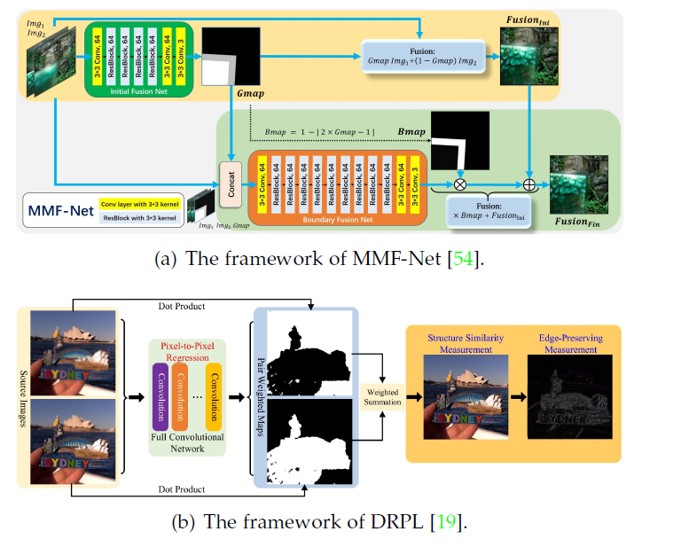
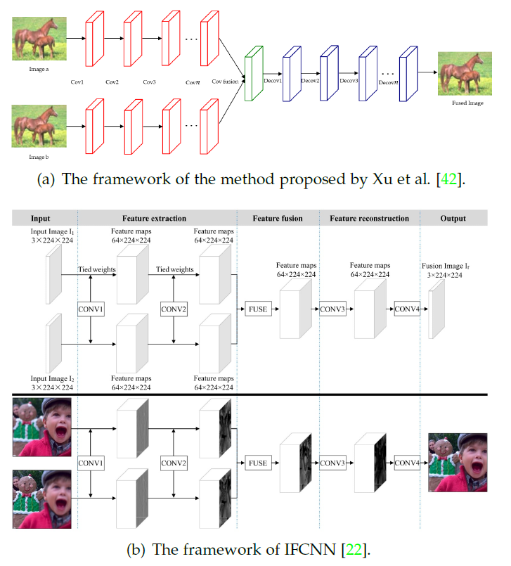
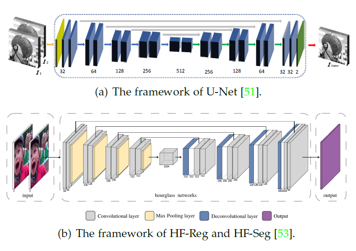
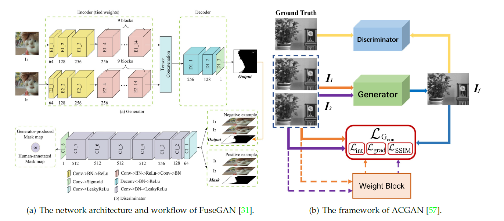
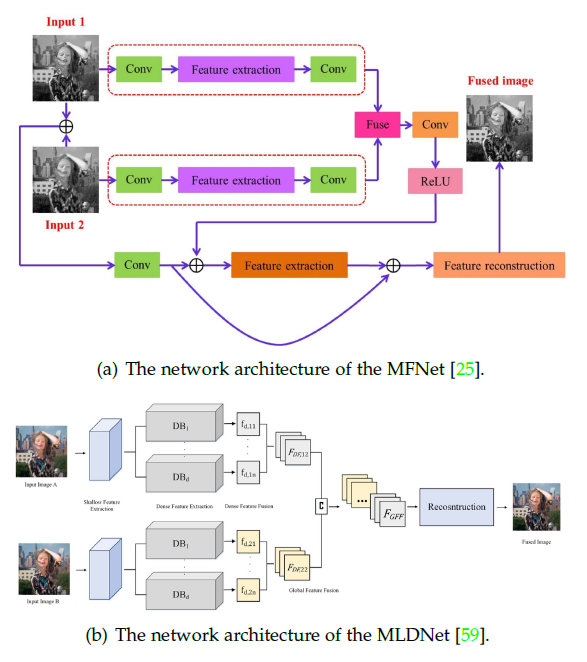

#### 多视角图片融合 （Multi-focus Image Fusion)

[Git 地址](https://github.com/xingchenzhang/MFIF)

[toc]

##### 1. 背景

1. 由于相机成像深度的限制，很难得到全焦图片。因此MFIF方法已经有非常广泛的应用，例如：微图像融合、视觉传感器网络、视觉电力巡检、光学显微镜。
2. MFIF方法：基于空间域的方法和基于域变换的方法（spatial domain-based method and transform domain-based methods）。基于空间域的方法操作直接在空间域中，可分为基于像素、基于块、基于区域的。相比之下，基于域变换方法是将图像转换到另一个域中，然后进行融合，通过逆变换得到最终的结果，包括稀疏表示、多尺度方法、基于梯度域的方法以及混合方法。
3. 深度学习方法可以用来进行图片融合，例如 CNN、GAN以集成学习

##### 2. 利用深度学习MFIF

###### 2.1 Motivation

焦点测量或活动水平测量、规则融合是MFIF中的两个关键任务，人工设计的方法表示源图片的能力有限，结果不够robust。深度学习基于更深层的特征来学习，同时深度学习可以看做是自适应的。

###### 2.2 深度学习MFIF方法的分类

基于深度学习的MFIF方法概述如图：

###### 2.3 有监督学习

1. CNN

&ensp;&ensp; &ensp; Liu et al., 2017 利用CNN得到决策图，然后利用像素平均的方式得到最终图像，如图：

基于决策图的方法

+ 改进焦点测量：p-CNN 像素级CNN、Siamese CNN (更深层的CNN) 
+ 多层次特征：MLFCNN，利用1*1的卷积降低特征的维度
+ 多尺度特征：MCNN 使用多尺度训练获得理想决策图；MADCNN 多尺度视觉注意力CNN；利用小波获取高频和低频信息，然后送到CNN中
+ 注意力机制：MADCNN, SSAN
+ 处理聚焦与散焦边界：MMF-Net 首次考虑聚焦扩散效应的研究，利用两个级联子网：融合子网与边界融合子网。
+ 全卷积算法：以上除了MADCNN、MMF-Net(如图)均用到全连接网络， 全连接层会消耗大量的计算资源； DRPL（如图，但是对于边界存在问题）

+ 端到端的方法

  端到端的方法的优势为：直接通过训练得到最终的结果，不需要后期处理。

  

  &ensp;&ensp; __IFCNN__ 特征大小保持不变，利用的为感知 loss，可适用于其他的图片融合任务。

  &ensp;&ensp; 

  &ensp;&ensp; 上图为单流的MFIF结构为U-net；MLCNN将每一层的特征进行融合，最后综合生成图片。

  + GAN 

    

  + 集成学习：ECNN, HCNN

  + 其他监督学习方法：

    MFIF （基于去噪自编码器和深度学习网络）
    

###### 2.4 无监督深度学习

监督深度学习需要大量的标注数据，因此无监督学习是很有必要的

1. CNN

   + 端到端的模型

     MFNet，主要基于非参考的SSIM损失函数：$Loss(x_1,x_2,\hat{y}) = 1 - \frac{1}{N}\sum_{\omega=1}^{N}S(x_1,x_2, \hat{y}| \omega)$ , 其中$x_1,x_2$为原始图像，$\hat{y}$ 为融合后的图像，$\omega$ 为local window，
     $$
     S(x_1, x_2, \hat{y} | \omega) = \left\{ \begin{aligned}
     SSIM(x_1, \hat{y}|\omega) &  & if\ \ std(x_1|\omega) \ge std(x_2|\omega) \\
     SSIM(x2, \hat{y}| \omega) &  & otherwise
     \end{aligned}\right.
     $$
     $SSIM(x_1, \hat{y} | \omega)$ 是原始图像$x_1$与合成图像$\hat{y}$ 在local window $\omega$ 下的SSIM值（Structure Similarity 结构似度）
     
     
     
     
     
     $$SSIM(x, y) = \frac{(2\mu_x\mu_y + c_1)(2\sigma_{xy} + c_2)}{(\mu_x^2 + \mu_y^2+c_1)(\sigma_x^2+\sigma_y^2+c_2)}$$
     
     $\mu_x$ 是 $x$ 的平均值，$\sigma_x^2$ 为 $x$ 的方差， $\sigma_{xy}$ 为 $x$ 与 $y$ 的协方差；$c_1 = (k_1L)^2; c_2 = (k_2L)^2$ 用来维持稳定的常数。$L$ 是像素的动态范围， $k_1 = 0.01, k_2= 0.03$ .
     
     FusionDN 将不同的图像融合任务制定为一个统一的densely connected network，利用elastic weight consolidation 防止在学习过程中忘记之前学习的东西，同时在损失函数中不仅用到$L_{SSIM}$，还加入了感知损失与梯度损失。
     
     U2Fusion 在 MFNet 基础上做了两个重要的修正，保留 degree assignment 时利用的为提取到的特征信息而不是原图，损失函数为 $\mathcal{L} = \mathcal{L}_{SSIM} + \alpha \mathcal{L}_{mse}$。基于决策图的方法。
     
   + 基于决策图的模型
     
     SESF基于 encoder 与 decoder 的方式，在SESF中利用编码器获取深度特征，利用这些特征和空间频率获取焦点图，采用一致性验证方法获得最终决策图
     
     
     
     

2. 基于GAN的方法

   MFF-GAN 利用自适应决策块评估基于源图像的模糊程度，设计content loss 强制生成器产生融合的结果与焦点源图像的分布相同。

###### 2.5 总结

许多深度学习可以将测量与融合放到一起学习，无监督大多数为端到端的模型，同时无监督模型中SSIM损失函数很重要。

##### 3. 数据集

1. 捕获不同deep的相同图像
2. 合成数据
3. 利用广场数据得到多焦点图像

##### 4.  评估指标

​	MFIF 算法质量评估比较困难，主要由于任务的ground truth 数据不可用。有两种常用评价方式：主观评价、客观评价。主观评价具有耗时、标准不同意的缺点。

​	客观评价可以分为：

1. 基于信息论的度量

   + Cross Entropy (交叉熵， CE) 
     $$
     CE = \frac{CE_{A,F} + CE_{B,F}}{2} \\
     CE_{X,F} = \sum_{i = 0}^{255}h_x(i)log_2\frac{h_x(i)}{h_F(i)} \\
     h(i) 为Image\ normalized\ histogram
     $$

   + Entropy(EN， 熵)

     EN 用来衡量融合图像的信息量
     $$
     EN = - \sum_{l = 0}^{L -1}p_llog_2p_l \\
     L 代表 the\ number\ of \ gray\ level;\\ p_l 代表 normalized\  histogram\ of\ correspinding\ gray\ level
     $$

   + Mutual  information (MI，互信息)

     MI 衡量源图像到融合图像传输的信息量，
     $$
     MI = MI_{A, F} + MI_{B, F} \\
     MI_{X,F} = \sum_{x,f}p_{X,F}(x,f)log_2\frac{p_{X,F}(x,f)}{p_X(x)p_{F}(f)} \\
     p_X(x) 为图片的 marginal\ histograms \\
     p_{X,F}(x,f) joint\ histogram\ of \ X\ and \ F
     $$

   + Feature mutual information(FMI，特征互信息)
     $$
     FMI = MI_{\hat{A},\hat{F}} + MI_{\hat{B},\hat{F}} \\
     \hat{A},\hat{B},\hat{F} 特征图
     $$

   + Normalized mutual information(NMI， 归一化互信息)
     $$
     NMI = 2[\frac{MI_{A,F}}{H(A)+H（F)}+\frac{MI_{B,F}}{H(B)+H（F)}] \\
     H(\cdot) 代表图片entropy 
     $$

   + Peak signal-to-noise ratio (PSNR，峰值信噪比)
     $$
     PSNR = 10log_{10}\frac{r^2}{MSE} \\
     MSE = \frac{MSE_{A,F}+MSE_{B,F}}{2} \\
     MSE_{X,F} = \frac{1}{MN}\sum_{i =1}^{M-1}\sum_{j=1}^{N-1}(X(i,j) -F(i, j))^2
     $$

   + Nonlinear correlation information entropy ($Q_{NCIE}$，非线性相关信息熵)

     $Q_{NCIE}$ 测量图像之间的非线性相关，非线性相关矩阵$R$ 基于非线性相关系数 NCC
     $$
     R = \left[\begin{array}{ccc}
     1 & NCC_{A,B} & NCC_{A,F} \\
     NCC_{B,A} & 1 & NCC_{B,F} \\
     NCC_{F,A} & NCC_{F,B} & 1
     \end{array}\right] \\
     Q_{NCIE} = 1 + \sum_{i=1}^{3}\frac{\lambda_i}{3}log_{256}\frac{\lambda_i}{3} \\
     \lambda_i 为矩阵R的特征值
     $$

   + Tsallis entropy (TE)
     $$
     			TE=I_{A,F}^{\alpha}(x, f) + I_{B,F}^{\alpha}(x, f) \\
     I_(X,F)^{\alpha} = \frac{1}{\alpha -1}(1 - \sum_{x,f}\frac{(p_{X,F}(x,f))^{\alpha}}{(p_X(x)p_F(f))^{\alpha -1}})
     $$
     

2. 基于图像特征的指标

   + Average gradient(AG，平均梯度)

     测量融合后图片的梯度信息来表示其细节以及纹理。
     $$
     AG = \frac{1}{MN}\sum_{i =1}^{M}\sum_{j =1}^{N}\sqrt{\frac{\nabla F_x^2(i,j) + \nabla F_y^2(i,j)}{2}} \\
     \nabla F_x^2(i,j) = F(i, j) -F(i +1. j)
     $$

   + Edge intensity(EI，边缘强度)
     $$
     EI = \sqrt{S_x^2 + S_y^2} \\
     S_x = F * h_x;\ S_y = F * h_y \\
     h_x = \left[\begin{array}{ccc}
     -1 & 0 & 1 \\ -2 & 0 & 2 \\ -1 & 0 & 1
     \end{array}\right]
     ,\ 
     h_x = \left[\begin{array}{ccc}
     -1 & -2 & -1 \\ 0 & 0 & 0 \\ 1 & 2 & 1
     \end{array}\right]
     $$

   + Edge based similarity measurement ($Q^{AB/F}$，基于边缘相似性的测量)
     $$
     Q^{AB/F} = \frac{\sum_{i =1}^{M}\sum_{j =1}^{N}(Q^{A,F}(i,j)\omega^A(i, j) + Q^{B,F}(i,j)\omega^B(i, j))}{\sum_{i =1}^{M}\sum_{j =1}^{N}(\omega^A(i, j) + \omega^B(i, j))} \\
     其中 Q^{X,F}(i,j) 是edge\ information\ preservation\ value\\
     Q^{X,F}(i,j) =Q^{X,F}_g(i,j)Q^{X,F}_a(i,j) \\
     Q^{X,F}_g(i,j) 和Q^{X,F}_a(i,j) 分别代表 the \ edge\ strength\ and \ orientation\ preservation\ values \\
     \omega^X 代表图片对于融合结果的重要性
     $$

   + Standard deviation(SD，标准差)
     $$
     SD = \sqrt{\sum_{i =1}^{M}\sum_{j =1}^{N}(F(i, j)-\mu)^2}
     $$

   + Spatial frequency(SF, 空间频率)
     $$
     SF = \sqrt{RF^2 + CF^2} \\
     RF = \sqrt{\sum_{i =1}^{M}\sum_{j =1}^{N}(F(i, j)-F(i, j -1))^2} \\
     CF = \sqrt{\sum_{i =1}^{M}\sum_{j =1}^{N}(F(i, j)-F(i - 1, j))^2}
     $$
     

3. 基于图像结构的指标

   + Structural similarity index measure(SSIM， 结构相似度测量)
     $$
     SSIM_{X,F} = \sum_{x,f}\frac{2\mu_x\mu_f+C_1}{\mu_x^2+\mu_f^2 + C_1} 
     \cdot \frac{2\sigma_x\sigma_f+C_1}{\sigma_x^2+\sigma_f^2 + C_1} 
     \cdot \frac{\sigma_{xf}+C_3}{\sigma_x\sigma_f+C_3} \\
     其中 \mu 代表均值 \sigma 表示方差；\sigma_{xf} 表示协方差 \\
     C_1 = (K_1 \times L)^2; C_2 = (K_2 \times L)^2; C_3 = C_2 / 2 \\
     K_1 = 0.01； K_2 = 0.03; L = 255 \\
     SSIM = SSIM_{A,F} + SSIM_{B,F}
     $$

   + Yang's metric($Q_Y$)
     $$
     Q_Y = \left\{ \begin{aligned}
     \lambda(\omega)SSIM(A,F|\omega) + (1 - \lambda(\omega)) SSIM(B,F|\omega) & & if \ SSIM(A,B|\omega) \ge 0.75 \\
     max(SSIM(A,F|\omega), SSIM(B,F|\omega)) & & if \ SSIM(A,B|\omega) <  0.75 
     \end{aligned}
     \right. \\
     \omega\ is \ local\ window;\ \lambda(\omega) = \frac{s(A|\omega)}{s(A|\omega) +s(B|\omega)},\\ \ s\ local\ measure\ of\ image\ variance\ within\ window\ \omega
     $$
     

4. 人类感知启发的指标

   + Human visual perception($Q_{CB}$, 人类真实感知)
     $$
     Q_{CB} = \frac{1}{MN}(\sum_{i =1}^{M}\sum_{j =1}^{N}\beta_A(i,j)W_{A,F}(i,j)+\beta_B(i,j)W_{B,F}(i,j)) \\
     W_{A,F}(i,j)与W_{B,F}(i,j) 从原图到合成图像的 contrast \ transformed \\
     \beta_A 与 \beta_B saliency\ map
     $$

   + Visual Information fidelity (VIF，视觉信息保真度)

     首先，源图像和融合后的图像被分解成几个子带，它们又被分成不同的块。 第二，每个块的视觉信息有无失真被计算。 三、每个子带的VIF被计算。 最后，整体度量计算为每个子带的加权总和。 正如所建议的VIF的作者，使用了4个子带。

##### 5.  结果总结

四种常规方法得到较好结果（GFDF，QB，TF，MFM)，较好的机器学习方法为CNN，Lytro，MFI-WHU，MFFW。相对于端到端的模型，决策图的模型可以得到更加好的结果，主要后期的一致性验证处理有效地增加结果的准确性。然而利用不同的衡量标准，各个模型的结果存在一定差异。

大多数基于深度学习的MFIF，不能给出令人满意的融合图像，表明基于深度学习的MFIF方法不表现出由于传统方法的优势。主要由于目前缺少基于实际数据的图像融合的数据集，同时loss function的设计非常的重要。

